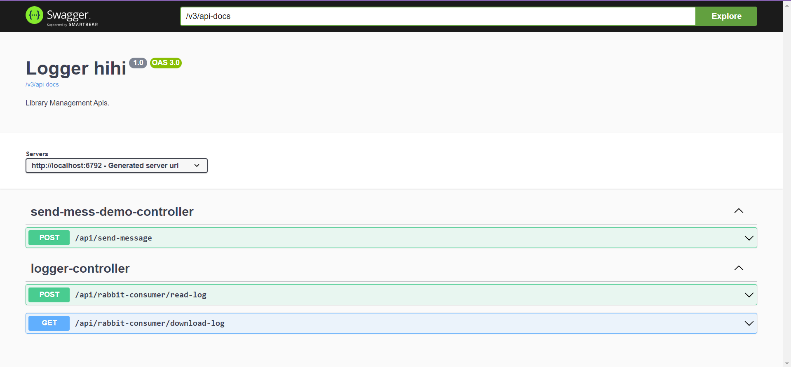

# **Rabbitmq Consumer**

###### Project chịu trách nhiệm lắng nghe và ghi các message log được gửi về từ các module trong Website cổng thông tin bộ môn UDPM

## **1. Cấu hình kết nối tới rabbit**
- Trong file cấu hình kết nối với rabbit: 
  - Cấu hình tạo rabbit trên docker

    spring.rabbitmq.host=localhost 
    spring.rabbitmq.port=5672
    spring.rabbitmq.username=guest
    spring.rabbitmq.password=guest
    

  - Cấu hình tạo rabbit cloud
    
        spring.rabbitmq.host=fly.rmq.cloudamqp.com
        spring.rabbitmq.port=5672
        spring.rabbitmq.username=wkiumvhx
        spring.rabbitmq.password=YM8ELqAlcyTqbxePp_PKYQ51M6SAiL0V
        spring.rabbitmq.virtual-host=wkiumvhx

    -  Note: Chỉ cấu hình 1 trong 2 cách kết nối với rabbit
- Cấu hình vào queue riêng của từng module

      rabbit.name.queue=fpl.datn.name.log
      rabbit.topic.exchange=fpl.datn.exchange.log
      rabbit.route.key=fpl.datn.key.log

    - **Note**: cấu hình trên từng module khác nhau
      
- Cấu hình đường dẫn folder trỏ đến thư mục
    
        `path.file.csv= articles-project/`

- Cấu hình domain đến Consumer

        `domain.rabbit.listen= http://localhost:6792`

## **2. Tạo Bean kết nối với Rabbit**

        package com.articlesproject.infrastructure.rabbit;
        
        import org.springframework.amqp.core.Binding;
        import org.springframework.amqp.core.BindingBuilder;
        import org.springframework.amqp.core.Queue;
        import org.springframework.amqp.core.TopicExchange;
        import org.springframework.beans.factory.annotation.Value;
        import org.springframework.context.annotation.Bean;
        import org.springframework.context.annotation.Configuration;
        
        @Configuration
        public class RabbitConfig {
        
            @Value("${rabbit.name.queue}")
            private String nameQueue;
        
            @Value("${rabbit.topic.exchange}")
            private String exchangeQueue;
        
            @Value("${rabbit.route.key}")
            private String routeQueue;
        
            @Bean
            public TopicExchange topicExchange() {
                return new TopicExchange(exchangeQueue);
            }
        
            @Bean
            public Queue logQueue() {
                return new Queue(nameQueue);
            }
        
            @Bean
            public Binding binding(Queue logQueue, TopicExchange topicExchange) {
                return BindingBuilder.bind(logQueue).to(topicExchange).with(routeQueue);
            }
        }

## **3. Tạo Service Producer => đẩy message lên queue**

    package com.articlesproject.infrastructure.rabbit;
    
    import com.articlesproject.infrastructure.logger.entity.LoggerObject;
    import com.google.gson.Gson;
    import org.springframework.amqp.rabbit.core.RabbitTemplate;
    import org.springframework.beans.factory.annotation.Autowired;
    import org.springframework.beans.factory.annotation.Value;
    import org.springframework.stereotype.Service;
    
    @Service
    public class RabbitProducer {
    
        @Autowired
        private RabbitTemplate amqpTemplate;
    
        @Value("${rabbit.route.key}")
        private String routeQueue;
    
        @Value("${rabbit.topic.exchange}")
        private String exchangeQueue;
    
        @Value("${path.file.csv}")
        private String pathFolder;
    
        // Gửi log thông điệp vào RabbitMQ
        public void sendLogMessage(LoggerObject loggerObject) {
            loggerObject.setPathFile(pathFolder + loggerObject.getPathFile());
            Gson gson = new Gson();
            String message = gson.toJson(loggerObject);
            amqpTemplate.convertAndSend(exchangeQueue, routeQueue, message, messagePostProcessor -> {
                messagePostProcessor.getMessageProperties();
                return messagePostProcessor;
            });
        }
    }

-   Note: khi send loggerObject bắt buộc phải ép về kiểu ký tự

## **4. Tạo đối tượng ghi vào file csv**

        package com.articlesproject.infrastructure.logger.entity;
        
        import lombok.AllArgsConstructor;
        import lombok.Builder;
        import lombok.Getter;
        import lombok.NoArgsConstructor;
        import lombok.Setter;
        
        import java.io.Serializable;
        
        @Getter
        @Setter
        @NoArgsConstructor
        @AllArgsConstructor
        @Builder
        public class LoggerObject implements Serializable {
        
            private String content;
        
            private String ip;
        
            private String mail;
        
            private String method;
        
            private String createDate;
        
            private String pathFile;
        
        }

- **Note**: mỗi module có thể tạo các thuộc tính tùy ý. Nhưng bắt buộc phải có thuộc tính **`pathFile`**.

## **5. Kết nối với api đọc file log**

- API getAll dữ liệu
  

        package com.articlesproject.infrastructure.logger.service.impl;
        
        import com.articlesproject.infrastructure.logger.entity.LoggerObject;
        import com.articlesproject.infrastructure.logger.service.LoggerConnectService;
        import org.springframework.beans.factory.annotation.Autowired;
        import org.springframework.beans.factory.annotation.Value;
        import org.springframework.core.ParameterizedTypeReference;
        import org.springframework.http.HttpEntity;
        import org.springframework.http.HttpHeaders;
        import org.springframework.http.HttpMethod;
        import org.springframework.http.MediaType;
        import org.springframework.http.ResponseEntity;
        import org.springframework.stereotype.Service;
        import org.springframework.web.client.RestTemplate;
        
        import java.util.List;
        
        @Service
        public class LoggerConnectServiceImpl implements LoggerConnectService {
        
            @Autowired
            private RestTemplate restTemplate;
        
            @Value("${domain.rabbit.listen}")
            private String domainRabbit;
        
            @Override
            public List<LoggerObject> readFile(LoggerObject filter, Long orderBy) {
                String apiUrl = domainRabbit + "/api/rabbit-consumer/read-log/all";
                // Tạo đối tượng HttpHeaders để cấu hình HTTP Headers nếu cần
                HttpHeaders headers = new HttpHeaders();
                String authorizationToken = "Bearer " + articleSession.getToken();
                headers.set("Authorization", authorizationToken);
                headers.setContentType(MediaType.APPLICATION_JSON); // Thiết lập kiểu dữ liệu của requestBody
        
                // Đối tượng HttpEntity chứa requestBody và headers
                HttpEntity<LoggerObject> requestEntity = new HttpEntity<>(filter, headers);
        
                ResponseEntity<List<LoggerObject>> responseEntity =
                        restTemplate.exchange(apiUrl + "?orderBy=" + orderBy, HttpMethod.POST, requestEntity,
                                new ParameterizedTypeReference<List<LoggerObject>>() {
                                });
                return responseEntity.getBody();
            }
        }

- API getPage dữ liệu

    @Autowired
    private LoggerUtil loggerUtil;

    @Override
    public PageableObject readFileFunction(LoggerFunction filter, Long orderBy, int page, int size) {
        String apiUrl = domainRabbit + "/api/rabbit-consumer/read-log/page";
        // Tạo đối tượng HttpHeaders để cấu hình HTTP Headers nếu cần
        HttpHeaders headers = new HttpHeaders();
        String authorizationToken = "Bearer " + articleSession.getToken();
        headers.set("Authorization", authorizationToken);
        headers.setContentType(MediaType.APPLICATION_JSON); // Thiết lập kiểu dữ liệu của requestBody
        filter.setPathFile(loggerUtil.getPathFileInProperties(ConfigurationsConstant.PATH_FILE_CSV) + filter.getPathFile());

        // Đối tượng HttpEntity chứa requestBody và headers
        HttpEntity<LoggerFunction> requestEntity = new HttpEntity<>(filter, headers);

        ResponseEntity<String> responseEntity =
                restTemplate.exchange(apiUrl + "?orderBy=" + orderBy + "&page=" + page + "&size=" + size, HttpMethod.POST, requestEntity,
                        new ParameterizedTypeReference<String>() {
                        });

        return new Gson().fromJson(responseEntity.getBody(), PageableObject.class);
    }

- **Note**: 
    - khi ghi file dùng Object nào thì đọc file bắt buộc phải dùng Object tương tự.
    - Api có tìm kiếm lịch sử, trên các thuộc tính truyền vào.
    - Khi xử dụng tìm kiếm bắt buộc phải dùng đúng `pathFile` mình truyền vào
    - Trong `RequestParam` có trường `orderBy` 
      
        - Nếu truyền 1: đọc từ dòng log ghi đầu tiền đến dòng log cuối cùng
    
        - Nếu truyền 0 hoặc không truyền gì: đọc từ dòng log cuối cùng lên dòng log ghi dầu tiên
    
    - Trong `RequestParam` có trường `size`: truyền vào số lượng trang nếu chế độ phân trang được bật (Không nhập gì mặc định là 50)
    - Trong `RequestParam` có trường `page`: truyền vào trang hiện tại nếu chế độ phân trang được bật (Không nhập gì mặc định là trang đầu tiên)

## **6. Demo một chức năng được ghi log**

    @Autowired
    private RabbitProducer rabbitProducer;
    
    @Override
    @Transactional
    public Category addCategory(CensorCreateCategoryRequest request) {
        Random random = new Random();
        int number = random.nextInt(10000);
        String code = String.format("CA%04d", number);
        Category ca = new Category();
        ca.setCode(code);
        ca.setName(request.getName());
        ca.setCategoryStatus(CategoryStatus.ACTIVE);
        censorCategoryRepository.save(ca);
        try {
            LoggerObject loggerObject = new LoggerObject();
            loggerObject.setContent("Thể loại '" + ca.getName() + " - " + ca.getCode() + "' đươc thêm vào hệ thống.");
            rabbitProducer.sendLogMessage(LoggerUtil.genContent(new LoggerObject()));
        } catch (Exception ex) {
            ex.printStackTrace();
        }
        return ca;
    }

## **7. Một số Util có thể tạo**

        package com.articlesproject.util;
        
        import com.articlesproject.infrastructure.logger.entity.LoggerObject;
        
        import java.util.Date;
        
        public class LoggerUtil {
        
            public static LoggerObject genContent(LoggerObject data) {
                data.setCreateDate(new Date().toString());
                data.setMail("mail fix cứng");
                data.setMethod("Method fix cứng");
                data.setIp("Ip fix cứng");
                return data;
            }
        
        }

## **8. Một số tính năng đi kèm**
- Swagger: `http://localhost:6792/swagger-ui/index.html#/`
    

- Rabbitmq: 
    - Clouds: `https://fly.rmq.cloudamqp.com/#/`
     
        - Tài khoản: `wkiumvhx`
        - Mật khẩu: `YM8ELqAlcyTqbxePp_PKYQ51M6SAiL0V`
    
    - Build Docker: 
        - `docker pull rabbitmq`
        - `docker run -it --rm --name rabbitmqnametest -p 5672:5672 -p 15672:15672 rabbitmq:3.12-management`
        - Tài khoản: `guest`
        - Mật khẩu: `guest`
        - Host: `http://localhost:15672/#/`
    
    
    
    

    

